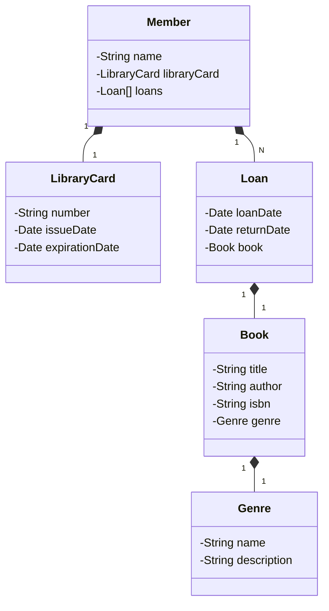

# Sistema de Biblioteca API

Este é um projeto de API para gerenciar um sistema de biblioteca. Ele foi desenvolvido usando Java, Spring Boot, e Hibernate para persistência de dados.

## Funcionalidades

- Cadastro de membros da biblioteca
- Cadastro de livros
- Empréstimo e devolução de livros
- Consulta de histórico de empréstimos

## Pré-requisitos

Antes de começar, certifique-se de ter instalado em sua máquina:

- Java 11 ou superior
- Maven 3.x
- MySQL 5.x (ou outra base de dados de sua escolha)
- Git

## Diagrama de Classes 

