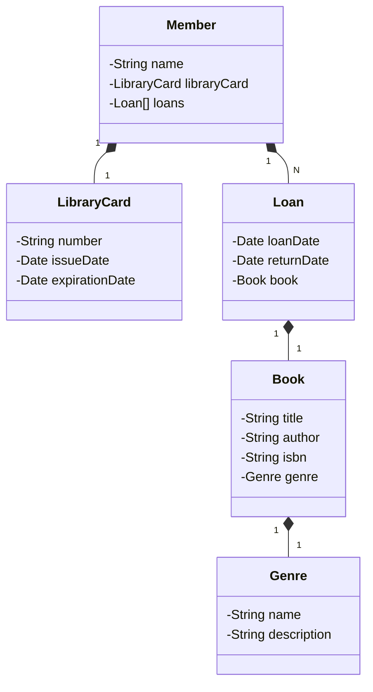

## Sistema de Biblioteca (Domínio da API)

### Diagrama de Classes 

```mermaid
classDiagram
  class Member {
    -String name
    -LibraryCard libraryCard
    -Loan[] loans
  }

  class LibraryCard {
    -String number
    -Date issueDate
    -Date expirationDate
  }

  class Loan {
    -Date loanDate
    -Date returnDate
    -Book book
  }

  class Book {
    -String title
    -String author
    -String isbn
    -Genre genre
  }

  class Genre {
    -String name
    -String description
  }

  Member "1" *-- "1" LibraryCard
  Member "1" *-- "N" Loan
  Loan "1" *-- "1" Book
  Book "1" *-- "1" Genre

```

